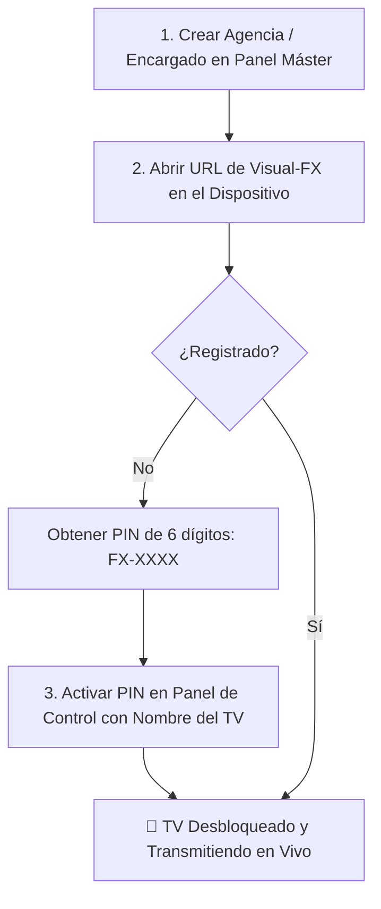

# 📺 Guía Operativa: Registro de Nuevas Agencias y Vinculación de Pantallas

**Manual de Procedimiento para Agencias Fenix • Sistema Visual-FX**

---

## 📌 Resumen del Flujo de Trabajo

Para instalar y habilitar una nueva pantalla (Smart TV, Laptop, Celular, TV Box, Tablet) en una Agencia Fenix, se sigue un procedimiento de **3 pasos principales**:

---

## 🏢 PASO 1: Alta de la Agencia y Encargado

Antes de conectar las pantallas de una nueva sede, el **Super Administrador** (`hector_owner`) debe crear la cuenta correspondiente a esa agencia:

1. Ingresar al sistema Visual-FX desde la PC de administración.
2. Hacer clic en **⚙️ Panel de Control** (esquina superior derecha).
3. Seleccionar la pestaña **`👥 Usuarios y Agencias`**.
4. En el formulario **"Crear Nuevo Usuario / Agencia Fenix"**, completar:
   - **Usuario**: Ej. `agencia_valencia`
   - **Contraseña**: Clave de acceso para el encargado (Ej. `valencia2026`)
   - **Nombre Completo o Sede**: Ej. `Agencia Valencia - Av. Bolívar`
   - **Rol Jerárquico**: `🏢 Encargado de Agencia` (`AGENCY_MANAGER`)
5. Presionar el botón **`CREAR CUENTA`**.

---

## 📱 PASO 2: Apertura en el Dispositivo de la Agencia

El proceso varía ligeramente según el tipo de hardware que se instale en la agencia:

### 🅰️ Opción A: Smart TV / Android TV / Fire TV Stick
1. Encender el televisor o TV Box y abrir la aplicación del **Navegador Web** (Chrome, Firefox, Amazon Silk o el navegador nativo del Smart TV).
2. Ingresar la dirección web del servidor Visual-FX (ejemplo: `https://visual-fx.agenciasfenix.com` o la IP de la red local).
3. Aparecerá en la pantalla gigante el mensaje: **🔒 Dispositivo No Autorizado** y un **Código de Activación de 6 Dígitos** (Ej. `FX-4912`).

### 🅱️ Opción B: Laptop o PC de Taquilla / Sala
1. Abrir Google Chrome o Microsoft Edge en la computadora.
2. Ingresar a la URL del servidor Visual-FX.
3. Si la PC se conectará a un televisor secundario por cable **HDMI**, arrastrar la ventana del navegador al televisor secundario.
4. Presionar la tecla <kbd>F11</kbd> para activar el modo pantalla completa sin barras del navegador.

### 🆂 Opción C: Celulares o Tablets
1. Abrir Safari (iOS/iPhone) o Google Chrome (Android).
2. Navegar a la URL de Visual-FX e iniciar sesión con el usuario de la agencia.
3. En el menú del navegador, seleccionar **"Agregar a la pantalla de inicio"** (Add to Home Screen). Esto creará un icono directo como si fuera una aplicación nativa.

---

## 🔑 PASO 3: Autorización de la Pantalla mediante PIN

Una vez generado el código `FX-XXXX` en la pantalla del dispositivo:

1. El encargado de la sede o el soporte técnico ingresa al **⚙️ Panel de Control** desde cualquier teléfono o PC autorizada.
2. Ir a la pestaña **`📺 Televisores y Licencias`**.
3. En la sección **"Activar Nuevo Televisor por PIN"**:
   - **PIN**: Escribir el código de 6 dígitos que se ve en la pantalla no autorizada (Ej. `FX-4912`).
   - **Nombre del TV**: Asignar un nombre descriptivo para identificarlo (Ej. `TV 1 - Taquilla Principal`, `TV 2 - Area VIP`, `Laptop Gerencia`).
4. Hacer clic en **`ACTIVAR TELEVISOR`**.

¡De inmediato la pantalla del televisor o dispositivo se desbloqueará sin necesidad de reiniciar y comenzará la transmisión hípica en vivo HD!

---

## 🎛️ PASO 4: Configuración de Transmisiones en la Agencia

Una vez vinculada la pantalla:

1. **Selección de Matriz de Canales**:
   - Usar el control remoto de la TV o el teclado de la PC:
     - Pulsar <kbd>1</kbd>: Muestra **1 Hipódromo** en pantalla completa.
     - Pulsar <kbd>2</kbd>: Muestra **2 Hipódromos** simultáneos.
     - Pulsar <kbd>3</kbd>: Muestra **3 Hipódromos**.
     - Pulsar <kbd>4</kbd>: Muestra la matriz de **4 Hipódromos (2x2)** en HD.
2. **Asignación de Carreras / Hipódromos**:
   - En el menú lateral o desplegable de cada celda de video, seleccionar qué carrera/hipódromo proyectar en cada recuadro (ej. Celda 1: *Gulfstream Park*, Celda 2: *Saratoga*, Celda 3: *La Rinconada*, Celda 4: *Parx Racing*).
3. **Control de Audio**:
   - Para cambiar el audio que suena en los altavoces de la agencia, presionar las flechas direccionales o hacer clic en el botón **🔊 AUDIO ACTIVO** del canal deseado.

---

## 🛠️ Consejos de Optimización para Agencias

> [!TIP]
> **Modo Kiosco / Autostart en Smart TVs**: En Android TV o Fire Stick, se puede instalar la app gratuita *Auto Start App Manager* para que el navegador abra Visual-FX automáticamente al encender el televisor.

> [!NOTE]
> **Reconexión Automática**: Si hay una caída de luz o de internet en la agencia, Visual-FX se reconectará automáticamente a las señales en vivo tan pronto se restablezca la conexión sin perder la configuración de pantalla.

---
*Agencias Fenix © 2026 • Manual Operativo Visual-FX*
